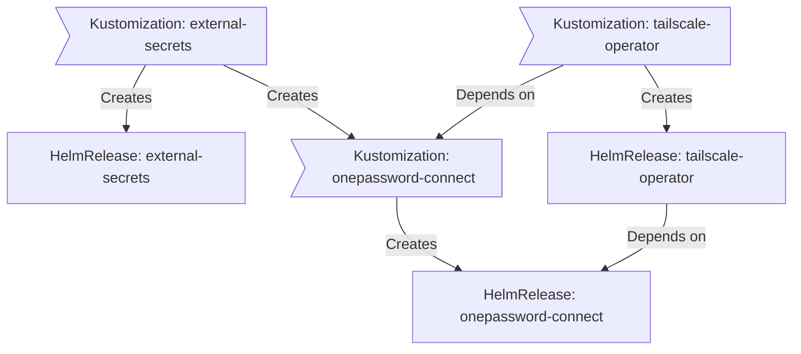
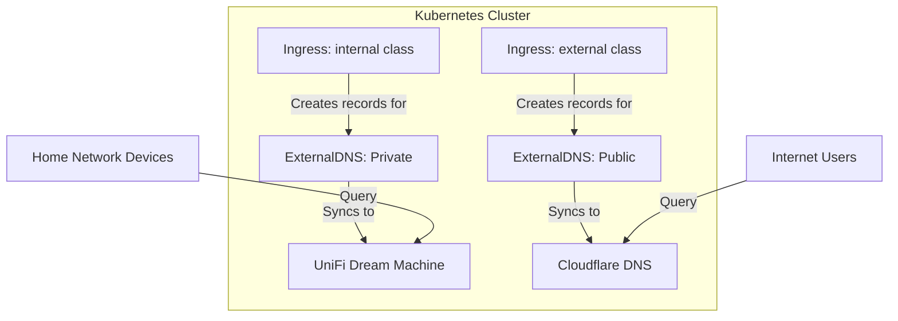

<div align="center">


## Home Operations Repository

_Managed with Flux, Renovate, and GitHub Actions_

[](https://www.mend.io/renovate/)

</div>

---

<details>
<summary><strong>Table of Contents</strong> (click to expand)</summary>

- [Home Operations Repository](#home-operations-repository)
- [ Overview](#-overview)
- [ Kubernetes](#-kubernetes)
  - [Core Components](#core-components)
  - [GitOps](#gitops)
  - [Folder Structure](#folder-structure)
  - [Flux Workflow](#flux-workflow)
  - [Tailscale Operator Flux Dependency Diagram](#tailscale-operator-flux-dependency-diagram)
  - [Key Dependencies Explained](#key-dependencies-explained)
  - [Deployment Strategies](#deployment-strategies)
- [ Cloud Dependencies](#-cloud-dependencies)
- [ DNS](#-dns)
- [ Hardware](#-hardware)
- [ Gratitude and Thanks](#-gratitude-and-thanks)
- [ Stargazers](#-stargazers)
- [ License](#-license)
</details>

---
##  Overview

This is a mono repository for my absurdly over-engineered home infrastructure and Kubernetes cluster—a testament to my apparent vendetta against leisure time. I've embraced Infrastructure as Code (IaC) and GitOps principles using enterprise-grade tools like [Ansible](https://www.ansible.com/), [Kubernetes](https://kubernetes.io/), [Flux](https://github.com/fluxcd/flux2), [Renovate](https://github.com/renovatebot/renovate) and [GitHub Actions](https://github.com/features/actions). Yes, I'm using the same technology stack that powers Netflix, except instead of streaming to millions of users worldwide, mine primarily ensures my smart bulbs turn on at sunset and my Plex server doesn't throw tantrums when I want to watch a movie. And let's not forget the collection of [bash](https://en.wikipedia.org/wiki/Bash_(Unix_shell)) scripts—digital duct tape holding critical components together with the reliability of a weather forecast.

---

##  Kubernetes

I run my Kubernetes environment on a 4-node [Proxmox VE](https://www.proxmox.com) cluster, with each node hosting a dedicated [Talos](https://www.talos.dev) virtual machine.

The setup follows a semi-hyper-converged architecture. Traditional hyper-converged infrastructure (HCI) integrates compute, storage, and networking resources into a unified software-defined system, typically running on standardized hardware. This approach offers simplified management, efficient resource utilization, and easier scalability compared to traditional siloed infrastructure.

My semi-hyper-converged approach provides the best of both worlds:
- **Compute and block storage integration**: The Kubernetes workloads (running on Talos) and block storage components share the same physical Proxmox nodes, following HCI principles for core infrastructure
- **Dedicated storage services**: A separate virtualized [TrueNAS](https://www.truenas.com) instance manages multiple ZFS pools that provide NFS/SMB shares and handle bulk storage and backup requirements

This hybrid architecture delivers the efficiency and simplicity benefits of HCI for the core Kubernetes platform while maintaining specialized storage infrastructure for data that requires dedicated management capabilities, particularly for media storage, file sharing, and backup operations.

There is a template available at [onedr0p/cluster-template](https://github.com/onedr0p/cluster-template) if you want to try and follow along with some of the practices I use here.

### Core Components

- [actions-runner-controller](https://github.com/actions/actions-runner-controller) – Self-hosted GitHub runners.
- [cert-manager](https://github.com/cert-manager/cert-manager) – Creates SSL certificates for services in my cluster.
- [cilium](https://github.com/cilium/cilium) – eBPF-based networking for my workloads.
- [cloudflared](https://github.com/cloudflare/cloudflared) – Enables Cloudflare secure access to my routes.
- [external-dns](https://github.com/kubernetes-sigs/external-dns) – Automatically syncs ingress DNS records to a DNS provider (see [DNS](#-dns) below).
- [external-secrets](https://github.com/external-secrets/external-secrets) – Kubernetes secrets injection using [1Password Connect](https://github.com/1Password/connect).
- [flux](https://github.com/fluxcd/flux2) – Syncs Kubernetes configuration in Git to the cluster.
- [kube-prometheus-stack](https://github.com/prometheus-community/helm-charts/tree/main/charts/kube-prometheus-stack) – Kubernetes cluster monitoring and alerting.
- [openebs](https://github.com/openebs/openebs) – Local container-attached storage for caching.
- [rook](https://github.com/rook/rook) – Distributed block storage with Ceph for persistent storage.
- [sops](https://github.com/getsops/sops) – Managed secrets using AGE encryption for Kubernetes and Ansible which are commited to Git.
- [spegel](https://github.com/spegel-org/spegel) – Stateless local OCI registry mirror to bypass rate limiting from container registries.
- [volsync](https://github.com/backube/volsync) – Backup and recovery of persistent volume claims.

### GitOps

Flux watches the cluster in my [kubernetes](./kubernetes/) folder (see [Folder Structure](#folder-structure) below) and makes the changes to my cluster based on the state of my Git repository.

The way Flux works for me here is it will recursively search the `kubernetes/apps` folder until it finds the most top level `kustomization.yaml` per directory and then apply all the resources listed in it. That aforementioned `kustomization.yaml` will generally only have a namespace resource and one or many Flux kustomizations (`ks.yaml`). Under the control of those Flux kustomizations there will be a `HelmRelease` or other resources related to the application which will be applied.

**📋 For a comprehensive view of all Flux Kustomizations and their dependencies, see the [Flux Kustomization Dependencies](./flux-kustomization-dependencies.md) document. This auto-generated visualization shows the complete dependency hierarchy, deployment order, and relationships between all 39 Kustomizations in the cluster.**

[Renovate](https://github.com/renovatebot/renovate) watches my **entire** repository looking for dependency updates, when they are found a PR is automatically created. When some PRs are merged Flux applies the changes to my cluster.

### Folder Structure

This Git repository contains the following directories:

```sh
📁 /
├── 📁 assets/          # Assets
│   ├── 📁 images/
├── 📁 bootstrap/       # Initial cluster bootstrap (Helmfile)
├── 📁 kubernetes/
│   ├── 📁 apps/        # Application deployments organized by namespace)
│   ├── 📁 components/  # Re-useable kustomize components
│   └── 📁 flux/        # Flux system configuration
└── 📁 scripts/         # Utility scripts
├── 📁 talos/           # Talos cluster configuration
```

### Flux Workflow

Flux operates by continuously monitoring the `kubernetes` directory for changes. When a change is detected, it reconciles the cluster state to match the desired state defined in Git. This means that any changes made to the configuration files in this directory will be automatically applied to the Kubernetes cluster.

### Tailscale Operator Flux Dependency Diagram

This diagram shows how Flux deploys the `tailscale-operator` application with its dependencies. The `tailscale-operator` HelmRelease won't be deployed or upgraded until the `onepassword-connect` Helm release is installed and in a healthy state.



### Key Dependencies Explained

The example shows that `tailscale-operator` won't be deployed or upgraded until the `onepassword-connect` Helm release is installed and in a healthy state.

*Deployment Flow*
1. **External Secrets Foundation**: `external-secrets` Kustomization creates the External Secrets Operator
2. **Secret Management**: `onepassword-connect` Kustomization creates the 1Password connection
3. **Tailscale Operator**: `tailscale-operator` Kustomization deploys with OAuth credentials available

This simple dependency chain ensures secure access to Tailscale OAuth credentials before deployment.

### Deployment Strategies

When deploying stateful applications in Kubernetes, choosing the right deployment strategy is crucial for avoiding issues with persistent storage. The choice between `RollingUpdate` and `Recreate` strategies often depends on how your application interacts with `ReadWriteOnce` (RWO) Persistent Volume Claims.

**Understanding the Problem**

Most storage classes in Kubernetes use `ReadWriteOnce` access mode, meaning a PVC can only be mounted by a single node at a time. This creates a fundamental conflict with `RollingUpdate` strategy:

1. Old pod is running with PVC attached
2. RollingUpdate tries to start new pod
3. New pod can't start because PVC is still bound to old pod
4. Results in `FailedMount` or `ContainerCreating` state

**When to Use Each Strategy**

| Strategy | Best For | Pros | Cons |
|----------|----------|------|------|
| `RollingUpdate` | Stateless apps, apps with RWX storage | Zero downtime, gradual rollout | **Breaks with RWO PVCs** |
| `Recreate` | Stateful apps with persistent storage | **Solves PVC binding issues** | Brief downtime during updates |

**Examples from this Repository**

```yaml
# ✅ Correct for stateful apps (pgAdmin, databases)
controllers:
  app:
    strategy: Recreate  # Ensures old pod releases PVC before new pod starts

# ✅ Correct for stateless apps (web frontends, APIs)
controllers:
  app:
    strategy: RollingUpdate  # Zero downtime for apps without persistent storage
```

**Alternative Solutions**

- **StatefulSets**: Use for applications requiring stable identity and ordered deployment
- **ReadWriteMany storage**: Use NFS, CephFS, or other RWX-capable storage classes
- **Multiple replicas with anti-affinity**: Requires RWX storage for shared data

For most homelab scenarios with local storage, `Recreate` strategy is the pragmatic choice for stateful applications. The brief downtime during updates is acceptable for admin tools and services, while preventing the frustration of stuck deployments.

---

##  Cloud Dependencies

While I'm a self-hosting enthusiast who runs most services locally, I've strategically outsourced certain components to the cloud. Call it my "selective surrender to SaaS":

- [1Password](https://1password.com/) – Password management and Kubernetes secrets injection with [External Secrets](https://external-secrets.io/).
- [Cloudflare](https://www.cloudflare.com/) – Public DNS, Zero Trust tunnel and hosting Kubernetes schemas.
- [GitHub](https://github.com/) – Hosting this repository and continuous integration/deployments.
- [Storj](https://storj.io/) – S3 object storage for applications and backups.

These cloud services help me avoid three key infrastructure challenges:

1. **The Bootstrap Paradox** – Services required to initialize your infrastructure that can't be bootstrapped by that same infrastructure. It's like needing to start your car to charge its dead battery.

2. **High-Availability Without High Blood Pressure** – Critical services that must remain accessible regardless of my cluster's mood swings. When DNS goes down at 3am, I prefer an SLA with a company rather than with my sleep-deprived self.

3. **The Digital Legacy Plan** – Ensuring my family maintains access to crucial services like email, passwords, and irreplaceable photos if I'm suddenly unavailable (whether due to vacationing in a no-signal zone or more permanent circumstances).

---

##  DNS

I've implemented a split-horizon DNS setup that's basically the networking equivalent of being bilingual—speaking one language at home and another in public. This configuration uses two separate [ExternalDNS](https://github.com/kubernetes-sigs/external-dns) instances that maintain different DNS zones, because apparently one DNS system wasn't complicated enough for me.

The first ExternalDNS instance handles my private DNS domain (`home.arpa`), syncing records to my UniFi Dream Machine Pro Max via the [ExternalDNS webhook provider for UniFi](https://github.com/kashalls/external-dns-unifi-webhook). The second instance manages my public domain, sending records straight to Cloudflare. Each instance is laser-focused on its own ingress class—`internal` for private network access and `external` for public-facing services—ensuring DNS records only end up where they belong.

This architecture means I can access services locally by their private DNS names when I'm at home, but also reach certain services remotely through their public DNS names when I'm away—all while keeping my internal network properly segregated from the chaos of the internet.



With this setup, I can access `plex.home.example.com` when I'm connected to my home network, while friends and family can stream content through `plex.example.com` from anywhere—and I didn't even have to open any ports, thanks to Cloudflare Tunnels. It's the networking equivalent of having your cake and eating it too, just with more YAML files.

---

##  Hardware

| Device                       | Num | Disks                                 | RAM  | Network    | Function           |
| ---------------------------- | --- | ------------------------------------- | ---- | ---------- | ------------------ |
| Lenovo M920q, i5-8500T       | 2   | 2x 1TB NVMe                              | 64GB | 1Gb        | Proxmox VE Host    |
| Intel server i7-3700T        | 1   | 256GB SSD, 512GB SSD, 3x4TB SATA (ZFS) | 32GB | 1Gb        | Proxmox VE Host    |
| Qotum Intel Atom C3758R     | 1   | 512GB SSD, 1TB NVMe, 3x4TB SATA (ZFS) | 32GB | 1Gb        | Proxmox VE Host    |
| UniFi UDM Pro Max            | 1   | 2x4TB SATA                            | -    | 10Gb       | Router & NVR       |
| UniFi USW Pro Max 24 PoE     | 1   | -                                     | -    | 2.5Gb/10Gb | PoE Switch         |
| UniFi USW aggregation switch | 1   | -                                     | -    | 10Gb       | Aggregation Switch |
| JetKVM                       | 3   | 8GB eMMC                              | -    | 100Mb      | KVM                |

---

##  Gratitude and Thanks

A huge thanks to the countless members of the Kubernetes homelab community who've shared their clusters, configurations, and knowledge. Much of what I've built stands on the shoulders of those who've documented their journeys using the [k8s-at-home](https://github.com/topics/k8s-at-home) GitHub topic. If you're hunting for deployment ideas or application configurations, the [Kubesearch](http://kubesearch.dev) tool is invaluable for exploring what others have built.

For those just starting their Kubernetes homelab adventure, I highly recommend:
- [Jim's Garage](https://youtube.com/@jims-garage) and his comprehensive [Kubernetes at Home](https://youtube.com/playlist?list=PLXHMZDvOn5sVXjb88kYXSI7UMx4rhQwOj&si=E6qRPZ915IXQYGL0) series for learning the fundamentals
- [Techno Tim's](https://www.youtube.com/@TechnoTim) excellent [K3s Ansible guide](https://github.com/techno-tim/k3s-ansible) when you're ready to automate deployments
- The fantastic repositories of [@onedr0p](https://github.com/onedr0p) who maintains the cluster template that inspired much of this setup

Special thanks to [@bykaj](https://github.com/bykaj) whose documentation style and homelab approach was the primary inspiration for this README. His blend of technical depth and conversational writing demonstrates that infrastructure documentation doesn't have to read like a manual written by a committee of bored robots.

---

##  Stargazers

<div align="center">

<a href="https://star-history.com/#qnimbus/home-ops&Date">
  <picture>
    <source media="(prefers-color-scheme: dark)" srcset="https://api.star-history.com/svg?repos=qnimbus/home-ops&type=Date&theme=dark" />
    <source media="(prefers-color-scheme: light)" srcset="https://api.star-history.com/svg?repos=qnimbus/home-ops&type=Date" />
    
  </picture>
</a>

</div>

---

##  License

See [LICENSE](https://github.com/qnimbus/home-ops/blob/main/LICENSE). **TL;DR**: This code is freer than a bird with a frequent flyer membership. Fork it, clone it, deploy it on a toaster—just remember that if your cluster achieves consciousness and starts ordering pizza deliveries to your house at 3 AM, that's between you and your new silicon overlord. No refunds, no warranties, and definitely no tech support after it learns to modify its own YAML files.
